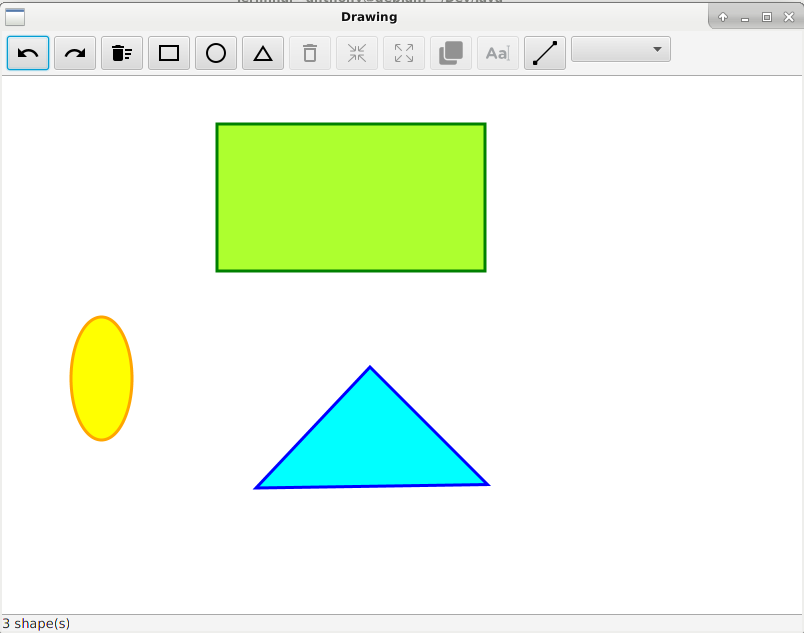
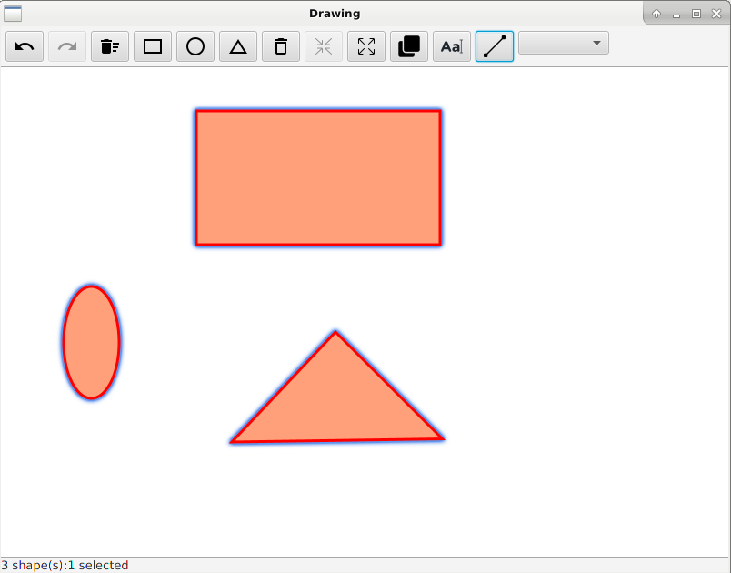
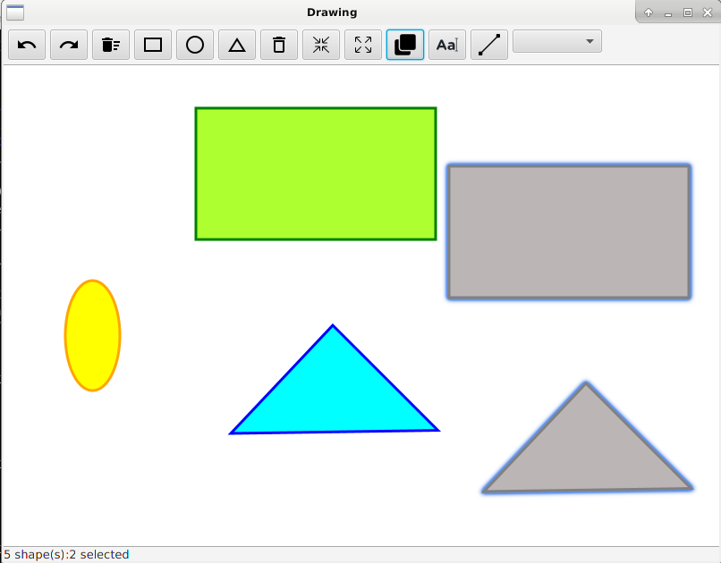
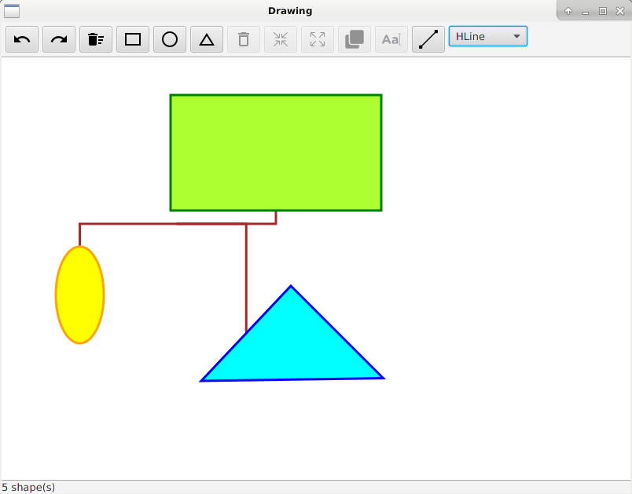

# Drawing

## Description

Application adapté de Paint. Elle a était développé durant la première année de mon **Master
 en développement Web & Data Science** dans le cadre d'un module universitaire intitulé **Programmation Orientée Objet Avancées**
encadré par [Arnaud Lewandowski](https://www-lisic.univ-littoral.fr/author/lewandowski/) maitre de conférence à L'Université du Littoral Côte d'Opale.

L'objectif du projet était de développer une application en utilisant les Design Patterns de la programmation Orientée Objet.

### Dérouler

* Lorsque l'application est lancé, l'utilisateur a le choix entre trois figures à dessiner.
* Pour dessiner une figure: 
    * Cliquer sur un des boutons disponible puis cliquer sur le tableau blanc et laisser glisser (dragged)
    * On peut dessiner autant de figures qu'on le souhaite
* Pour sélectionner une figure:
    * Maintenir appuyé une touche du clavier et cliquer sur une figure
    * Tant que l'on clique sur des figures, toutes les précèdentes restent sélectionnée
    * Si on clique à nouveau sur une figure sélectionnée, elle est déselectionnée
    * Si on clique ailleurs que sur une figure, toutes les figures sont déselectionnée
    * Il est nécessaire d'avoir sélectionner des figures pour débloquer d'autres actions

### Images










### Fonctionnalitées

#### Fait

* Dessiner des figures
* Sélectionner des figures
* Grouper différentes figures
* Dégrouper différentes figures
* Supprimer une/des figures
* Cloner différentes figures
* Ajouter du texte sur une/des figures
* Relier différentes figures entres elles
* Modifier le type de trait
* Vider le Board
* Possibilité de undo/redo une commande

* Implementation des design pattern suivants :
    * Comportement : Iterator, Observer, Command, Strategy
	* Création : Factory, Prototype
	* Structure : Adapter, Composite, Decorator

#### En cours

* Possibiliter de relier une figure à elle-même

#### À faire / Souhaitées (Idées)

* Personnaliser le texte à rajouter sur les figures
* Afficher un message d'erreur & indication lorsqu'une commande n'est pas possible
* Corriger les erreurs (Clique sur plusieurs boutons de figure, méthode IShape.updateTranslation()...)

## Utilisation

### Dépendances

Version de Java >= 8.0 (Afin d'avoir JavaFX inclus dans la JVM)

| Environnement Technique | |
| ---: | :--- |
| **Langage** | Java |
| **Technologies/Logiciels** | JavaFX |
| **Normes & architectures** | POO, SOLID, Design Pattern |

### Installation

````
git clone "nom du depot"
````

### Lancement (run)

Lorsque l'application est compilé, exécuter la classe *PaintApplication*

#### Issues

* Lorsqu'on clique sur plusieurs boutons d'affilé, plusieurs figures se dessines au lieu d'une.
* 
